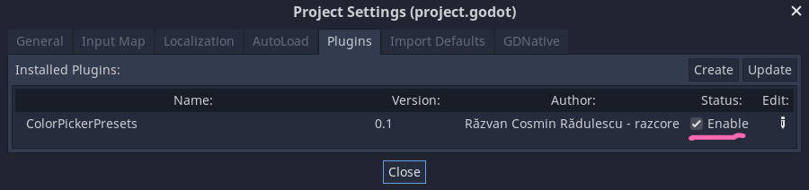
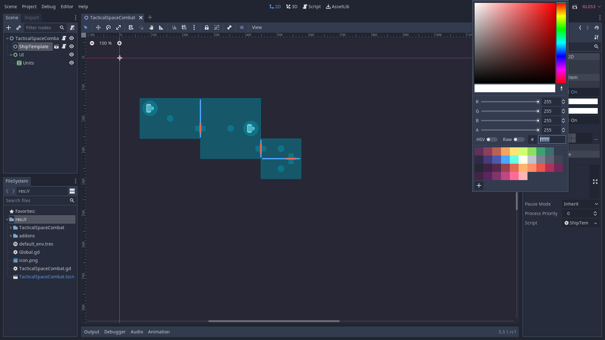

# GDQuest ColorPicker Presets

Reads a color presets `gpl` (GIMP Palette) file in the addon local directory, called `presets.gpl`. It adds the colors to the editor ColorPicker for quick access.

This repository includes a `presets.gpl` file as an example. It's the official GDQuest color palette.

## ✗ WARNING

> Compatible: Godot `>= v4.0`

The addon:

1. Doesn't check the length of the color palette/file.
1. Overwrites the _ColorPicker_ presets whenever you reopen the project or re-enable the addon.

## ✓ Install

### Using [Godot Package Manager](https://github.com/godot-package-manager)

1. `gpm init`.
1. Follow instructions with [NPMjs package](https://www.npmjs.com/package/gdquest.colorpicker_presets).
1. Enable the addon from `Project > Project Settings... > Plugins`.
1. Profit.

### Manual

1. Make a new folder at `res://addons/colorpicker_presets/`.
1. Copy the contents of this repository into `res://addons/colorpicker_presets/`.
1. Replace `res://addons/colorpicker_presets/presets.gpl` with your preferred version.
1. Enable the addon from `Project > Project Settings... > Plugins`.
1. Profit.

## Where do I find the presets?

They'll be available in the editor _ColorPicker_.

