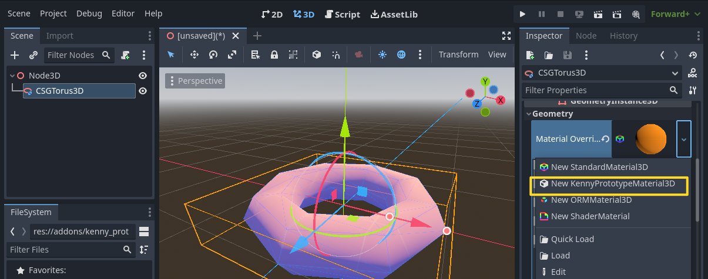

# GDQuest Kenny Prototype Material

Adds a 3D prototype material called `KennyPrototypeMaterial3D` that uses [CC0 textures by Kenny](https://www.kenney.nl/assets/prototype-textures).

## ✗ WARNING

> Compatible: Godot `>= v4.0`

## ✓ Install

### Using [Godot Package Manager](https://github.com/godot-package-manager)

1. `gpm init`.
1. Follow instructions with [NPMjs package](https://www.npmjs.com/package/gdquest.kenny_prototype_material) info.
1. Enable the addon from `Project > Project Settings... > Plugins`.
1. Profit.

### Manual

1. Make a new folder at `res://addons/kenny_prototype_material/`.
1. Copy the contents of this repository into `res://addons/kenny_prototype_material/`.
1. Enable the addon from `Project > Project Settings... > Plugins`.
1. Profit.
